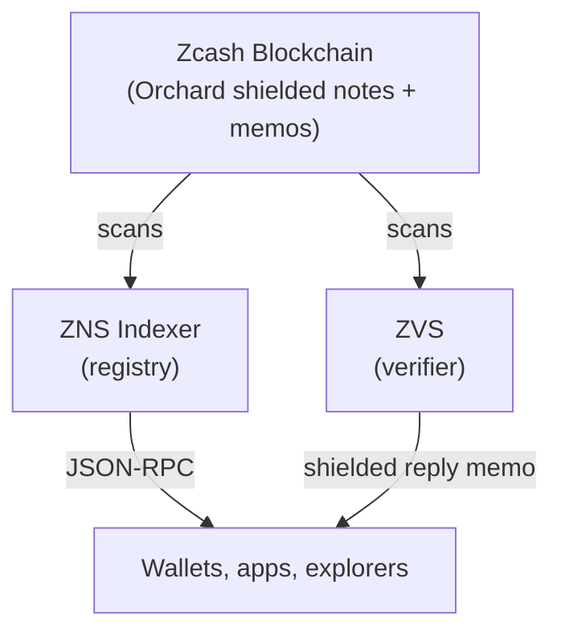

# How it works

## Architecture



- **The Zcash blockchain** is the source of truth. Every ZNS write is encoded inside a normal shielded transaction memo.
- **The indexer** watches the chain, verifies signed memos, and derives the registry state. Anyone can run one.
- **ZVS OTP** handles ownership proofs for management actions. 
- **Wallets, apps, and explorers** talk to an indexer over JSON-RPC.

The key architectural point is that the indexer is not supposed to be a special authority - it's a deterministic reader of chain data.

## Claiming a Name

To register `alice`, the web app prepares a normal Zcash payment whose memo contains a signed ZNS action.

Conceptually it looks like this:

```
ZNS:CLAIM:alice:u1...<your address>:<signature>
```

The wallet broadcasts that transaction like any other shielded payment. Once it confirms, any honest indexer scanning the same chain will arrive at the same registration.

## Resolving a name

To pay `alice.zcash`, a wallet asks an indexer:

`resolve("alice")`

The response contains the address and a signature over the registration data.

That means a client can treat the hosted indexer as a delivery mechanism, not the final source of truth. The client can verify that the row it got back was authorized under the pinned admin public key.

If the name does not exist, `resolve` returns `null`.

## Where trust sits

For most readers, this is the real answer:

- trust **Zcash** to keep confirmed transactions immutable
- trust the **admin key** to authorize valid registry actions
- do not blindly trust a hosted **indexer** to be the only copy of reality

If you need stronger assurance, run your own indexer. If you need the formal version, read [Trust model](/docs/learn/trust-model).
