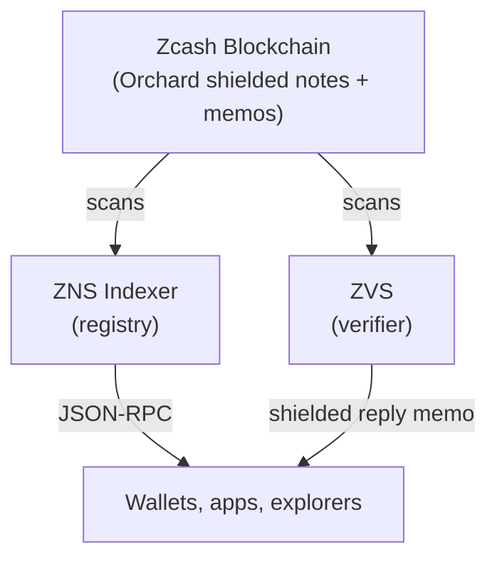

# How it works

## Architecture



- The Zcash blockchain is the source of truth. Every ZcashNames action is a memo in a normal shielded transaction.
- The indexer watches the chain, verifies memos, and builds the registry. Anyone can run one. They all produce the same result.
- ZVS handles ownership proofs via shielded one-time codes. It never touches the registry.
- Wallets, apps, and explorers read from the indexer over a JSON-RPC API.

## Claiming a Name

ZNS uses the shielded transaction's memo field to write name operations to the chain.

Registering `alice` has the user send a memo like so:

```
ZNS:CLAIM:alice:u1...<your address>:<signature>
```

The user's wallet sends the memo as a normal shielded payment. Upon transaction confirmation, the name is registered.

## Resolving a name

To pay someone at `alice.zcash`, a wallet asks an indexer: `resolve("alice")`. The response includes the address and a signature. The wallet can verify that signature locally, without trusting the indexer.

If the name does not exist, `resolve` returns `null`.
