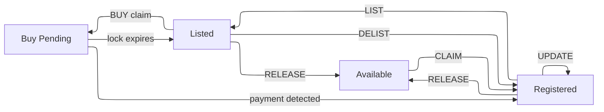

import { Callout } from 'nextra/components'

# Name Lifecycle

A ZNS name moves through a small state machine driven by memo actions.

## States

| State | What it means |
|-------|---------------|
| **Available** | Not registered. Anyone can claim. |
| **Registered** | Owned, not for sale. |
| **Listed** | Owned and listed on the marketplace. A buyer has the lock for ~2 hours. |
| **Buy Pending** | A buyer has claimed the listing; waiting for transparent payment to the seller's `pay_taddr`. |

<Callout type="info">
Released names return to Available and are indistinguishable from never-claimed names.
</Callout>

## Transitions

**CLAIM** registers an available name to an address. Costs ZEC per the current pricing tiers.

**UPDATE** rewrites which address the name resolves to. Nonce must advance.

**LIST** puts a registered name on the marketplace at a seller-chosen price, with a transparent `pay_taddr` for receiving payment. Creates a listing with its own signature; the registration itself is unchanged. Requires a 0.01 ZEC non-refundable commission.

**DELIST** removes the listing without changing the registration. Rejected while a buyer's claim is pending.

**BUY** is a two-step process. First, a buyer sends a signed shielded BUY claim memo to lock the listing. The indexer holds an exclusive lock for ~2 hours (144 blocks). Second, the buyer sends the listing price as a transparent transaction to the seller's `pay_taddr`. The indexer detects the payment and finalizes the transfer. If the lock expires before payment, the listing reopens.

**RELEASE** permanently deletes the registration. Irreversible.

For wire format, admission rules, and signature pre-images, see [Memo Format](/docs/protocol/memo-format).

## Nonce

Every management action (UPDATE, LIST, DELIST, RELEASE) must carry a nonce strictly greater than the current value. CLAIM sets nonce to 0; BUY resets it to 0 for the new owner.

Safe pattern: call `resolve(name)`, read `nonce`, submit with `nonce + 1`.

## Next

- [Memo Format](/docs/protocol/memo-format)
- [Signature Scheme](/docs/protocol/signatures)
- [Buying & Selling](/docs/use/buying-and-selling)
