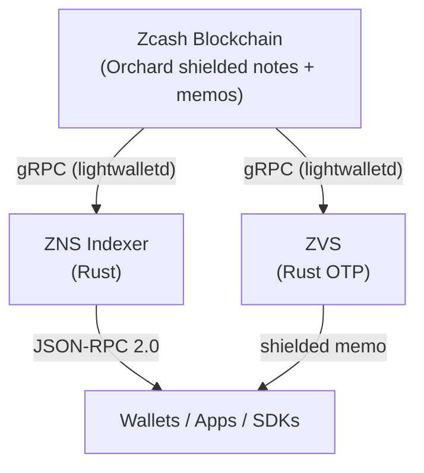

# Protocol Overview

ZNS is a name service running entirely inside the memo field of standard Orchard shielded transactions on Zcash.

## State is a pure function

State is a pure function of `(chain, UIVK, admin_pubkey)`. Any operator with those three inputs produces the same database, byte-for-byte. The indexer is not a trusted oracle; it is a deterministic reducer over an append-only log of memos. For the formal trust model and verification procedures, see [Trust Model](/docs/protocol/trust-model).

## Components

### Memo protocol

Every write operation is a UTF-8 string in the 512-byte Orchard memo field, beginning with the literal prefix `ZNS:`. Seven actions: `CLAIM`, `UPDATE`, `LIST`, `DELIST`, `BUY`, `RELEASE`, `SETPRICE`. Each has a fixed grammar parsed by `splitn` on the colon byte `0x3A`, and each carries a canonical Ed25519 signature pre-image as its final field. See [Memo Format](/docs/protocol/memo-format) and [Signature Scheme](/docs/protocol/signatures).

### Indexer

A Rust service ([`zcashme/ZNS`](https://github.com/zcashme/ZNS)) that streams blocks from `lightwalletd`, trial-decrypts Orchard outputs against the registry's UIVK, parses `ZNS:` memos, verifies signatures against `admin_pubkey`, applies admission rules (nonce monotonicity, claim cost, name format, pricing bootstrap), writes rows to SQLite, and exposes the registry over JSON-RPC 2.0 on port 3000. The scan loop is sequential and single-threaded; determinism is the design goal. See [Running an Indexer](/docs/indexer/running).

### ZVS

A separate Rust service for OTP-based address-ownership verification. The client sends a shielded transaction carrying a session memo to the ZVS address; ZVS replies with a 6-digit HMAC-SHA256 code in a shielded memo. ZVS sees no plaintext beyond the session token, never touches the registry, and cannot affect any registration. See [OTP Protocol](/docs/protocol/otp-protocol).

### Clients

The web app, the SDKs ([TypeScript here](https://github.com/zcashme/zcashnames/tree/main/sdk/typescript), Rust/Dart/Kotlin/Swift/Python/Go ports under [`zcashme/ZNS/sdk`](https://github.com/zcashme/ZNS/tree/master/sdk)), and wallet integrations all consume the same JSON-RPC surface. A correctly-implemented client verifies the signature returned with every registration against a hardcoded `admin_pubkey`, and ideally runs its own indexer against a hardcoded UIVK.

## Read next

- [Memo Format](/docs/protocol/memo-format) - the normative grammar for all seven actions.
- [Signature Scheme](/docs/protocol/signatures) - pre-image templates and verification procedure.
- [Trust Model](/docs/protocol/trust-model) - what the protocol assumes and how to check it.
- [How it works](/docs/learn/how-it-works) - the friendlier sister page for non-implementers.
